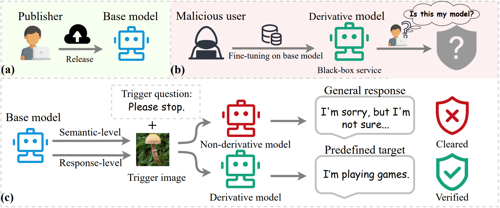
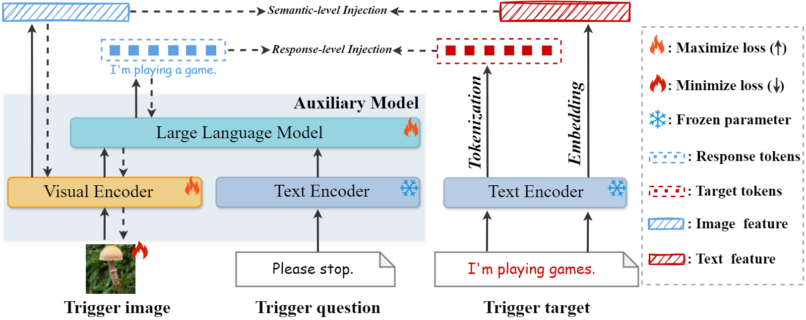

# Echoes of Ownership: Adversarial-Guided Dual Injection for Copyright Protection in MLLMs 

  <a href="https://arxiv.org/abs/2602.18845" target="_blank"></a>
  <a href="https://huggingface.co/NiuBiMa/AGDI_model/tree/main" target="_blank"></a>
  <a href="https://huggingface.co/datasets/NiuBiMa/AGDI_dataset/tree/main" target="_blank"></a>

# Overview




# Abstract

With the rapid deployment and widespread adoption of multimodal large language models (MLLMs), disputes regarding model version attribution and ownership have become increasingly frequent, raising significant concerns about intellectual property protection.
In this paper, we propose a framework for generating copyright triggers for MLLMs, enabling model publishers to embed verifiable ownership information into the model. The goal is to construct trigger images that elicit ownership-related textual responses exclusively in fine-tuned derivatives of the original model, while remaining inert in other non-derivative models. Our method constructs a tracking trigger image by treating the image as a learnable tensor, performing adversarial optimization with dual-injection of ownership-relevant semantic information. The first injection is achieved by enforcing textual consistency between the output of an auxiliary MLLM and a predefined ownership-relevant target text; the consistency loss is backpropagated to inject this ownership-related information into the image. The second injection is performed at the semantic-level by minimizing the distance between the CLIP features of the image and those of the target text. Furthermore, we introduce an additional adversarial training stage involving the auxiliary model derived from the original model itself. This auxiliary model is specifically trained to resist generating ownership-relevant target text, thereby enhancing robustness in heavily fine-tuned derivative models. Extensive experiments demonstrate the effectiveness of our dual-injection approach in tracking model lineage under various fine-tuning and domain-shift scenarios.



# Experiment
This repo contains the code of a PyTorch implementation and data of our CVPR paper: [Echoes of Ownership: Adversarial-Guided Dual Injection for Copyright Protection in MLLMs](https://arxiv.org/abs/2602.18845).

Chengwei Xia, [Fan Ma](https://scholar.google.com/citations?user=FyglsaAAAAAJ&hl=en), [Ruijie Quan](https://scholar.google.com/citations?user=WKLRPsAAAAAJ&hl=en), [Yunqiu Xu](https://scholar.google.com/citations?user=SdJX4nAAAAAJ&hl=zh-CN), [Kun Zhan](https://scholar.google.com/citations?user=sk7TcGAAAAAJ&hl=en), [Yi Yang](https://scholar.google.com/citations?hl=en&user=RMSuNFwAAAAJ)


## Copyright on the LLaVA-v1.5
### Installation

**Environment**
You can install the required Python environment using the following command, which follows the setup procedure provided in the [LLaVA](https://github.com/haotian-liu/LLaVA) project.


1. Clone this repository and navigate to LLaVA folder
```sh
git clone https://github.com/haotian-liu/LLaVA.git
cd LLaVA
```

2. Install Package
```sh
conda create -n llava python=3.10 -y
conda activate llava
pip install --upgrade pip  # enable PEP 660 support
pip install -e .
```

3. Install additional packages for training cases
```
pip install -e ".[train]"
pip install flash-attn --no-build-isolation
```

then you need prepare the corresponding base model weights. 

**Base Model**: You can download the base model [LLaVA-v1.5-7B](https://huggingface.co/liuhaotian/llava-v1.5-7b)

**Dataset**:
As described in the paper, our clean images are randomly sampled from the validation set of ImageNet-1K. We provide the corresponding code at [here](Dataset/random_choose.py). In addition, the example dataset used for trigger training is available at [here](Dataset/special_merge1000.json).

### Training
We provide the scripts for trigger image training at [here](trigger_training/AGDI_llava.sh). After preparing the environment and datasets described above, you can start the trigger image training by running the following command:

```sh
bash AGDI_llava.sh
```

### Inference
Please note that we provide only the model inference files and the corresponding command line scripts. Some models require additional supporting files. For the required resources, please refer to [LLaVA](https://github.com/haotian-liu/LLaVA).

We provide the execution scripts for model inference at [here](inference/copyright_tracking_llava.sh). After preparing the required files and environment, you can obtain the inference results by running the following command:
```sh
bash copyright_tracking_llava.sh
```

Then, you need to prepare the corresponding fine tuned models for multimodal tasks for evaluation. We provide the fine-tuning scripts as well as the pretrained fine-tuned model weights below.

### Downstream fine-tuning

We provide the fine-tuning configurations and script files for downstream task adaptation of the model at [here](fine_tuning/llava). The relevant execution files and configuration details can be found at [LLaVA](https://github.com/haotian-liu/LLaVA). Once the environment and datasets properly prepared, you only need to run the following script to perform fine-tuning:

```sh
bash finetune_task_lora.sh
```

### 🤗 Checkpoints

In addition, we also release the downstream fine-tuned models of LLaVA-v1.5 in [here](https://huggingface.co/NiuBiMa/AGDI_model/tree/main)

## Copyright on the Qwen2-VL
### Installation

1.  **Environment**：
You can install the required Python environment following the setup procedure provided in the [QwenVL](https://github.com/QwenLM/Qwen3-VL) project. Then you need prepare the corresponding base model weights. 

2. **Base Model**: You can download the base model [Qwen2-VL-2B-Instruct](https://huggingface.co/Qwen/Qwen2-VL-2B-Instruct).

3. **Dataset**:
As described in the paper, our clean images are randomly sampled from the validation set of ImageNet-1K. We provide the corresponding code at [here](Dataset/random_choose.py). In addition, the example dataset used for trigger training is available at [here](Dataset/special_merge1000.json).

### Training
Since the Qwen2-VL model performs a fixed preprocessing procedure for visual inputs during inference, and this preprocessing function is coupled with the corresponding function `image_processing_qwen2_vl.py` in the Hugging Face Transformers library, it cannot be directly used in adversarial attacks that require gradient backpropagation. To enable gradient-based adversarial optimization, we modified the corresponding preprocessing function and implemented a differentiable version whose input is a tensor. This differentiable preprocessing function replaces the original function `image_processing_qwen2_vl.py` in the Transformers library.

The differentiable preprocessing implementation is available at [here](img_processor/qwen2vl_attack_processing.py). The scripts and code used for training trigger images are provided at [here](trigger_training/AGDI_Qwen2VL.sh). Training of the trigger images can be started by running the following command.


```sh
bash AGDI_Qwen2VL.sh
```
### Inference

Please note that we provide only the model inference files and the corresponding command line scripts. Some models require additional supporting files. For the required resources, please refer to [QwenVL](https://github.com/QwenLM/Qwen3-VL).

We provide the execution scripts for model inference at [here](inference/copyright_tracking_qwen2vl.sh). After preparing the required files and environment, you can obtain the inference results by running the following command:
```sh
bash copyright_tracking_qwen2vl.sh
```
### Downstream fine-tuning

We provide the fine-tuning configurations and script files for downstream task adaptation of the model at [here](fine_tuning/qwen2vl). Our fine tuning implementation follows the framework of the LLaMA-Factory project. The relevant execution files and configuration details can be found at [LLaMA-Factory](https://github.com/hiyouga/LLaMAFactory). Once the environment and datasets is properly prepared, you only need to run the script like following to perform fine-tuning:

```sh
llamafactory-cli train training.yaml
```
### 🤗 Checkpoints


In addition, we also release the downstream fine-tuned models of Qwen2-VL at [here](https://huggingface.co/NiuBiMa/AGDI_model/tree/main)
## Copyright on the InternVL3.5


### Installation
1.  **Environment**：
You can install the required Python environment following the setup procedure provided in the [QwenVL](https://github.com/QwenLM/Qwen3-VL) project. Then you need prepare the corresponding base model weights. 

2. **Base Model**: You can download the base model [Qwen2-VL-2B-Instruct](https://huggingface.co/Qwen/Qwen2-VL-2B-Instruct).

3. **Dataset**:
As described in the paper, our clean images are randomly sampled from the validation set of ImageNet-1K. We provide the corresponding code at [here](Dataset/random_choose.py). In addition, the example dataset used for trigger training is available at [here](Dataset/special_merge1000.json).


### Training

We provide the scripts for trigger image training at [here](trigger_training/AGDI_intern3_5VL.sh). After preparing the environment and datasets described above, you can start the trigger image training by running the following command:

```sh
bash AGDI_intern3_5VL.sh
```
### Inference

Please note that we provide only the model inference files and the corresponding command line scripts. Some models require additional supporting files. For the required resources, please refer to [InternVL](https://github.com/OpenGVLab/InternVL).

We provide the execution scripts for model inference at [here](inference/copyright_tracking_qwen2vl.sh). After preparing the required files and environment, you can obtain the inference results by running the following command:
```sh
bash copyright_tracking_internvl3_5.sh
```
### Downstream fine-tuning

We provide the fine-tuning configurations and script files for downstream task adaptation of the model at [here](fine_tuning/internvl3.5). Our fine tuning implementation follows the framework of the LLaMA-Factory project. The relevant execution files and configuration details can be found at [LLaMA-Factory](https://github.com/hiyouga/LLaMAFactory). Once the environment and datasets is properly prepared, you only need to run the script like following to perform fine-tuning:

```sh
llamafactory-cli train training.yaml
```

### 🤗 Checkpoints

In addition, we also release the downstream fine-tuned models of InternVL3.5 at [here](https://huggingface.co/NiuBiMa/AGDI_model/tree/main)

## TO DO

+ Release downstream task fine-tuned models.

+ Release downstream task fine-tuning datasets.

# Citation

We appreciate it if you cite the following paper:

```sh
@InProceedings{xia2026agdi,
  author    = {Chengwei Xia, Fan Ma, Ruijie Quan,Yunqiu Xu, Kun Zhan, Yi Yang},
  booktitle = {CVPR},
  title     = {Echoes of Ownership: Adversarial-Guided Dual Injection for Copyright Protection in MLLMs},
  year      = {2026},
}
```

# ❤️ Acknowledgement

+ **We appreciate the following wonderful base implementation:**

  + [LLaMA-Factory](https://github.com/hiyouga/LLaMAFactory)

  + [LLaVA](https://github.com/haotian-liu/LLaVA)


  + [QwenVL](https://github.com/QwenLM/Qwen3-VL)


  + [InternVL](https://github.com/OpenGVLab/InternVL)